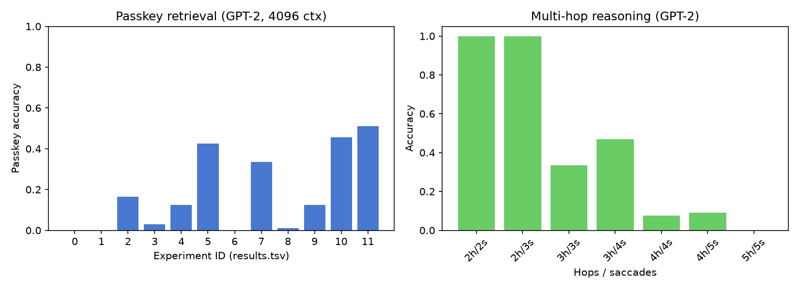

# Saccadic Attention

A novel attention mechanism for transformers inspired by the human visual system's saccadic eye movements and foveated processing. Instead of attending to all tokens uniformly (standard attention) or using static sparse patterns, this model learns a **sequential fixation policy** that dynamically decides where in the context to focus high-resolution attention, while maintaining low-resolution peripheral awareness of the full context.

## Core Idea

The human visual system solves the same computational problem that long-context LLMs face — processing a massive high-dimensional input under strict compute constraints. Biology's solution: **foveated resolution** (high acuity at the fixation point, rapidly degrading periphery) combined with **saccadic eye movements** (a learned policy that moves the fixation point to gather information sequentially).

We apply this strategy to transformer attention over token sequences.

### How It Differs from Prior Work

The closest prior work — the [Fovea Transformer](https://arxiv.org/abs/2311.07102) (He et al.) — uses a static fine-to-coarse attention pattern. Our key contributions:

1. **Learned saccadic controller** — dynamically decides where to fixate based on peripheral context
2. **Iterative multi-fixation processing** — accumulates understanding across sequential fixation steps
3. **Modality-agnostic design** — an information-gathering strategy, not a vision-specific trick

## Architecture

```
Input tokens (batch, seq_len, hidden_dim)
        │
        ▼
┌─────────────────────┐
│  Peripheral Encoder  │  O(n) global summary — block-wise pooling
│  (one-time, cheap)   │  of entire sequence into coarse map
└─────────┬───────────┘
          │
          ▼
┌─────────────────────────────────────────────┐
│  Saccadic Loop (repeat num_saccades times)  │
│                                             │
│  1. Controller picks fixation point         │
│     (Gumbel-Softmax over peripheral map)    │
│                                             │
│  2. Foveal Processor runs full attention    │
│     on window around fixation (O(w²))       │
│                                             │
│  3. Update peripheral map with new info     │
└─────────────────────────────────────────────┘
          │
          ▼
   Output (batch, seq_len, hidden_dim)
```

**Complexity:** O(n + k·w²) where n = sequence length, k = number of saccades, w = window size. For k=5, w=128 on a 4096-token sequence, this is ~5× cheaper than full O(n²) attention.

## Results



### Passkey Retrieval (GPT-2 backbone, 4096 context)

| Experiment | Accuracy | Fixation Distance | Notes |
|:---|---:|---:|:---|
| Baseline (no warmup) | 0.00 | 1565 | Controller doesn't learn to fixate |
| + supervised warmup | 0.17 | 685 | Warmup teaches fixation targeting |
| + warmup weight 1.5 | **0.43** | 190 | Controller learns to fixate near passkey |
| + extended training | **0.51** | 948 | Best accuracy, 1200s budget |

### Multi-Hop Reasoning (GPT-2 backbone)

| Hops | Saccades | Accuracy | Notes |
|:---|:---|---:|:---|
| 2 | 2 | **1.00** | Perfect — 2 saccades for 2 clues |
| 2 | 3 | **1.00** | Extra saccade doesn't hurt |
| 3 | 3 | 0.34 | Harder — needs to chain 3 clues |
| 3 | 4 | **0.47** | Extra saccade helps |
| 4 | 4 | 0.08 | 4-hop reasoning is difficult |

**Key finding:** The model learns to allocate saccades to information-carrying tokens. For 2-hop tasks, 2 saccades suffice for perfect accuracy. Adding saccades beyond the number of clues doesn't degrade performance.

## Project Structure

```
├── src/                    # Core implementation
│   ├── saccadic_attention.py   # Full module with iterative fixation loop
│   ├── peripheral_encoder.py   # O(n) block-wise peripheral encoding
│   ├── foveal_processor.py     # Windowed full attention at fixation
│   ├── saccadic_controller.py  # Gumbel-Softmax fixation policy
│   ├── gpt2_saccadic.py        # GPT-2 with saccadic attention layers
│   └── data.py                 # Passkey retrieval + multi-hop datasets
├── scripts/                # Experiment runners
├── results/                # Experiment outputs (TSV + JSON)
├── configs/                # YAML experiment configs
├── tests/                  # Unit + integration tests
└── docs/                   # Architecture notes + ideas
```

## Setup

```bash
pip install -r requirements.txt
```

### Quick smoke test

```bash
python experiment.py  # Runs passkey retrieval with default config (~10 min)
```

### Run multi-hop experiments

```bash
python scripts/run_gpt2_multihop.py
```

## References

- Greydanus et al., "Hamiltonian Neural Networks" (NeurIPS 2019) — physics-informed architecture inspiration
- He et al., "Fovea Transformer" (arXiv 2311.07102) — static foveated attention baseline
- Yarbus, "Eye Movements and Vision" (1967) — biological saccadic system
